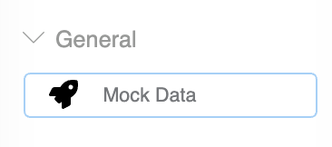
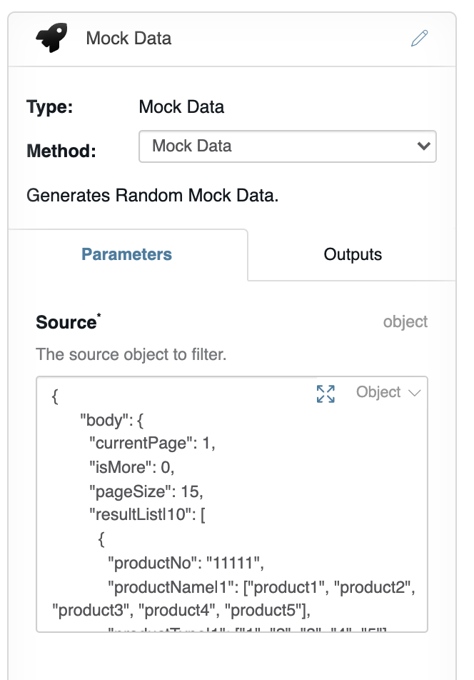
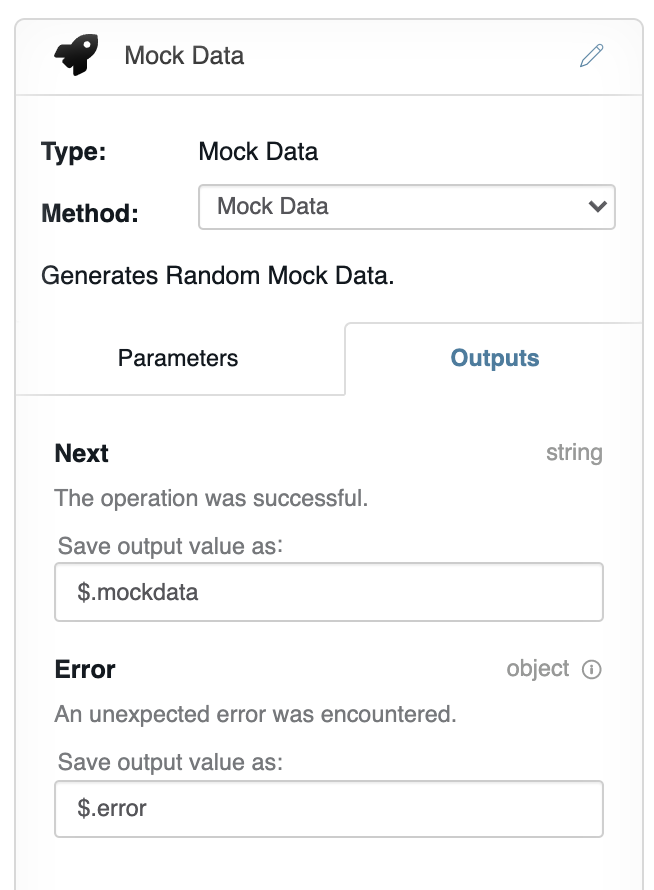
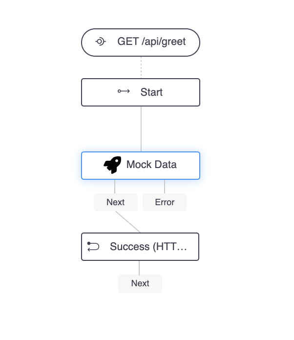
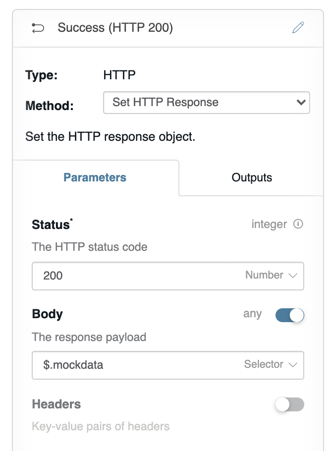

# api-builder-plugin-mockdata


This node is A plugin for Axway API Builder to create mock data like real world.

During API lifecycle, when the back-end API is not completed, the frontend simulates the backend interface manually in order not to affect the work efficiency.

1. We can use JSON files to simulate background data, but it is limited and cannot simulate the post, delete, patch and query of data
2. Json files simulation but data cannot be generated randomly

## When you have installed this flow node you get the following new option for your flow:




## Parameters:
object to set the data template



example:

```
{
    "body":{
        "currentPage":1,
        "isMore":0,
        "pageSize":15,
        "resultList|10":[
            {
                "productNo":"11111",
                "productName|1":[
                    "product1",
                    "product2",
                    "product3",
                    "product4",
                    "product5"
                ],
                "productType|1":[
                    "1",
                    "2",
                    "3",
                    "4",
                    "5"
                ],
                "status|1":[
                    "1",
                    "2"
                ],
                "gmtCreate":"@DATETIME('yyyy-MM-dd HH:mm:ss')",
                "gmtModified":"@now('yyyy-MM-dd HH:mm:ss')",
                "createUserCode":"@name"
            }
        ],
        "startIndex":0,
        "totalNum":100,
        "totalPage":1
    },
    "reCode":"0000",
    "reMsg":"success",
    "success":true
}
```
## output:
The random data



## The demo flow:



Set the http response body as `$.mockdata`. 



Finally , when you request the endpoint and can get random and real world data.


## Install
git clone 

```
git clone samxu-tech/api-builder-plugin-mockdata 
cd api-builder-plugin-mockdata
npm i 
```

Creating your API Builder service (` axway builder init apibuilder-mock`) as the same folder level as api-builder-plugin-mockdata, you can install this plugin using npm:

```
cd apibuilder-mock
npm i ../api-builder-plugin-mockdata
npm start
```

##  Note
The mockapi.svg come from [fontawesome](https://fontawesome.com/v5.15/icons/rocket?style=solid)

[How to desgin the mock template](http://mockjs.com/examples.html)
